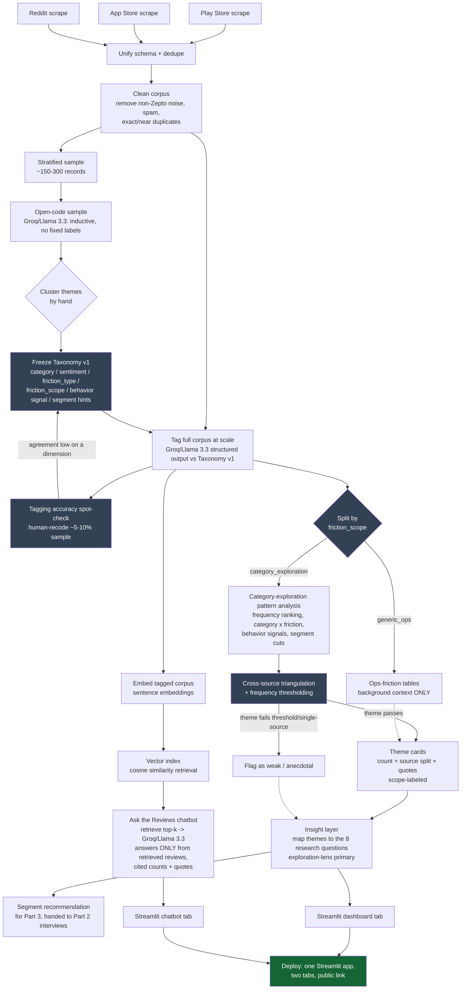

# Workflow — Pipeline Diagram

This is the end-to-end shape of the Discovery Engine, stage by stage. Each stage's output is the
next stage's input; the two validation touchpoints are called out because they can send work
backward (re-tag, revise taxonomy) rather than only flowing forward.

## Pipeline diagram

## Stage-by-stage description

| Stage | Input | What happens | Output | Human decision point? |
|---|---|---|---|---|
| Scrape (A1–A3) | Public source APIs/scrapers | Pull reviews/posts mentioning Zepto | Raw per-source JSON | No |
| Unify + dedupe (B) | Raw per-source JSON | Common schema, drop exact dupes across sources | Raw unified dataset | No |
| Clean (C) | Raw unified dataset | Strip spam/off-topic, keep language tag | Cleaned corpus | Light — spot-check noise filter |
| Sample (D) | Cleaned corpus | Stratify by source/rating, draw ~150–300 | Coding sample | No |
| Open-code (E) | Coding sample | LLM describes each review in its own terms, no fixed taxonomy | Raw descriptive tags | No |
| Cluster (F) | Raw descriptive tags | Group similar descriptions into candidate dimensions/values | Candidate taxonomy | **Yes — human judgment call** |
| Freeze taxonomy v1 (G) | Candidate taxonomy | Finalize dimensions + allowed values, write definitions + examples | Taxonomy v1 spec | **Yes** |
| Tag at scale (H) | Cleaned corpus + Taxonomy v1 | Structured Groq/Llama-3.3 output per record, including `friction_scope` | Tagged dataset | No |
| Accuracy spot-check (I) | Tagged dataset | Human recodes a sample, compares to LLM | Agreement % per dimension | **Yes — go/revise decision** |
| Scope split (S) | Tagged dataset | Route each record's friction by `friction_scope` | Ops table (context) vs. exploration table (primary) | No — rule is fixed at taxonomy-freeze time |
| Ops-friction tables (J1) | generic_ops records | Light frequency summary only — not analyzed further | Background-context table | No |
| Exploration pattern analysis (J2) | category_exploration records | Frequency, cross-tabs, segment cuts | Pattern tables (the ones that matter) | No |
| Triangulation + thresholds (K) | Exploration pattern tables | Multi-source check, minimum-count filter | Confirmed vs. weak themes | **Yes — threshold judgment** |
| Theme cards (M) | Confirmed themes + ops context | Attach counts, source split, quotes, scope label | Theme card set | No |
| Insight layer (N) | Theme cards | Explicit mapping to the 8 RQs, exploration-lens primary | Insight document | No |
| Segment recommendation (O) | Insight layer | Pick 1–2 candidate segments, flag inference vs. evidence | Handoff to Part 2/3 | **Yes — the actual PM call** |
| Embed corpus (P) | Tagged dataset | Generate sentence embeddings per review | Embedding index | No |
| Vector retrieval (Q) | Embedding index + user question | Cosine-similarity top-k lookup | Retrieved reviews | No |
| Chatbot answer (R) | Retrieved reviews + question | Groq/Llama 3.3 answers using retrieved reviews only, cites counts + quotes, declines if unsupported | Cited chat answer | No |
| Dashboard tab (T) / Chatbot tab (U) | Insight layer / chatbot | Build Streamlit UI | Two app tabs | No |
| Deploy (V) | Both tabs | Publish as one Streamlit app | **Public link** | **Yes — go-live** |

## Why this shape (short version)

The pipeline is deliberately **not** a straight line — it has two loops back (taxonomy revision
after spot-check, and a weak/strong fork at triangulation) because the brief explicitly asks for
quality validation, not just pattern generation. A pipeline that only flows forward would let a
bad taxonomy or an unrepresentative theme reach the insight layer unchecked. It also has an
explicit **fork right after tagging** (node S) that routes generic-ops friction into a
context-only side table instead of letting it compete with category-exploration friction for
analytical attention — without that fork, high-volume but low-relevance ops complaints (delivery
speed, refunds) would dominate frequency rankings and drown out the category-exploration signal
the 8 research questions actually need. Finally, the tagged dataset feeds **two parallel
consumers** — the pattern/insight path (dashboard) and the embedding/retrieval path (chatbot) —
which is why both terminate in the same deploy step rather than one blocking the other. See
[03_THOUGHT_PROCESS.md](03_THOUGHT_PROCESS.md) for the full reasoning behind each fork, and
[05_EDGE_CASES_AND_TESTING.md](05_EDGE_CASES_AND_TESTING.md) for what gets tested at each node.
